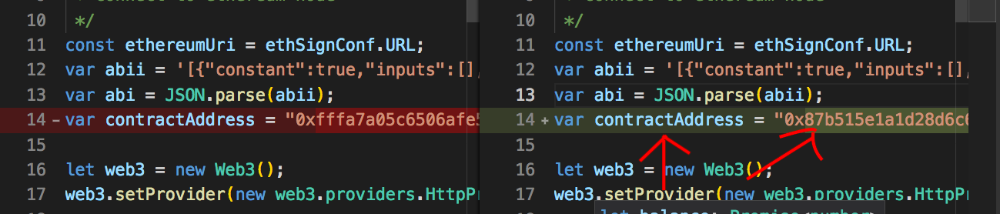
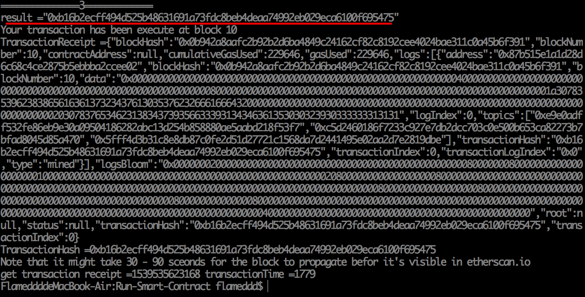
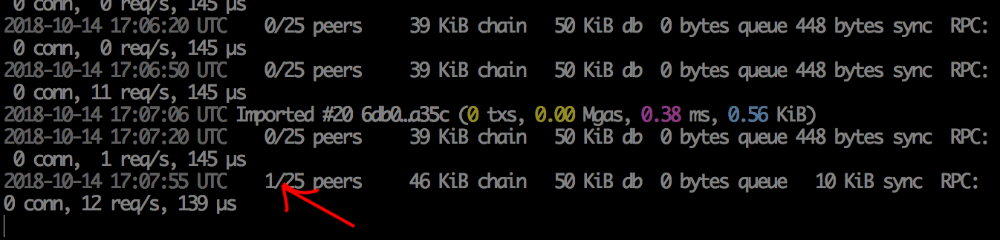

# Run-Smart-Contract
just a simple example

## prerequire
 - NodeJS
 - docker

 

 ## download repos
 cli 直接 clone
 > git clone https://github.com/onizi1224/Run-Smart-Contract.git

 或者  
 直接去 github 上下載
 [https://github.com/onizi1224/Run-Smart-Contract](https://github.com/onizi1224/Run-Smart-Contract)  
 

 ## pull docker images
 這要用指令拉檔案
 > docker pull onizi1224/ubuntuandparity:1.0  

成功 pull 下來可以用  

 > docker images  

指令查看 images  

## 執行 docker 來起第一個 Node
> docker run -ti -d -p 8545:8545  -p 30000:30000/udp    4d764d9e7223

可以用
 > docker ps

查看運行中的 `container` (如果它沒成功 or 掛掉了，用 `docker ps -a` 查看所有沒在運行中的 docker containers)

上面圖可以看到運行中的 `container id` 是 `b71f060b7dbd`

## 顯示 container 的 log
指令為
> docker logs -f b71f060b7dbd

## 顯示節點資訊
執行 post requset
 > curl --data '{"jsonrpc":"2.0","method":"parity_enode","params":[],"id":0}' -H "Content-Type: application/json" -X POST 127.0.0.1:8545

## 安裝 NodeJS 相關套件
這階段我們已經有一個 Node run 在機器上了。先將 cli 切換到`Run-Smart-Contract` 的目錄底下。執行
> npm install

## 部署 contract
> Node testDeployContract.js

成功後，會有相關的訊息出來，這邊要複製 `contract address`

## 測試交易
1. （上一步驟）複製出 contract address
2. 編輯 `testTransaction.js` 檔案
3. 改寫第 14 行的 contractAddress 欄位
4. 執行

> node testTransaction.js

## 取得交易資訊
1. 上一步驟複製 tx hash 
2. 編輯 `getTransactionInput.js` 檔案
3. 改寫第 14 行的 tx hash
4. 執行

> node getTransactionInput.js

## 起第 2 個 node
記得這邊 `TCP/UDP` 的 port 要改，跟第一個不一樣就好！

> docker run -ti -d -p 8540:8545  -p 30001:30000/udp 4d764d9e7223

> docker ps
能看到第 2 個 node 的 container 運行中。

用 log 指令查看 console 來複製 `enode address`
> docker logs -f container_id

## 加入 node
對 8584 下指令加入 上面的 enode address
 > curl --data '{"jsonrpc":"2.0","method":"parity_addReservedPeer","params":["enode://6934f3185502b4cbf930440d46502c08c9fa0fe58c90b9e3e53bd35d2ae94229f78e1370ecc2033ad6987daf5796398ff8da30b2cc92a944675bd0ff55b039a9@172.17.0.3:30000"],"id":0}' -H "Content-Type: application/json" -X POST 127.0.0.1:8545

回去看 8584 的 log，等約 5 秒後就會看到第 2 個 node 加入了

